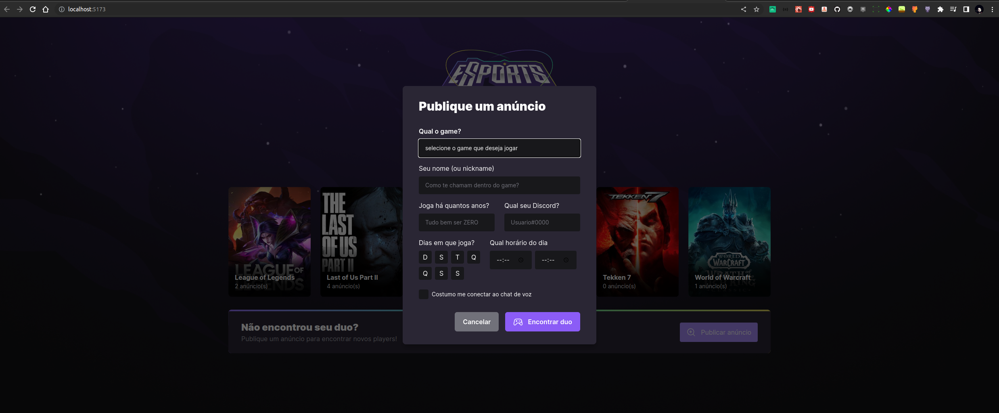
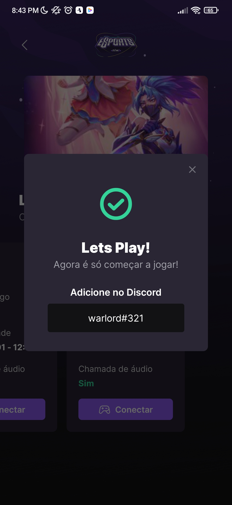

 

Mais uma semana top de desenvolvimento rolando com a Rocketseat.

  - [Descrição](#descrição)
  - [Ferramentas](#ferramentas)

## Descrição

Durante essa semana, a Rockeseat junto com você irá desenvolver a versão web e mobile da aplicação Find your Duo, uma plataforma que ajuda gamers a encontrar um parceiro ou parceira para jogar online seu game favorito, e tudo isso  conectado a api da Twitch. Você pode acessar o conteúdo da aula em: [Next Level Week](https://lp.rocketseat.com.br/nlw)

## Ferramentas

* [React](https://reactjs.org/)
* [React Native](https://reactnative.dev/)
* [Expo](https://expo.dev/)
* [Node.js](https://nodejs.org/en/)
* [Figma](https://www.figma.com/)

